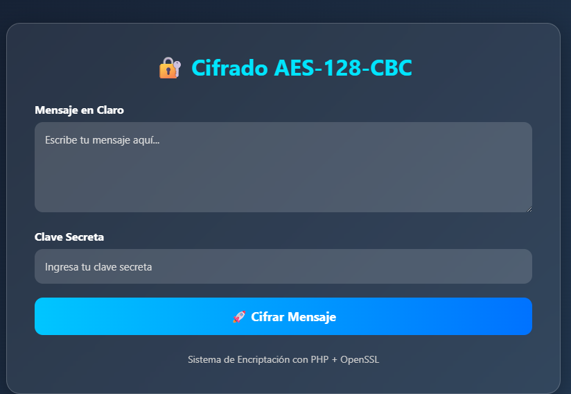
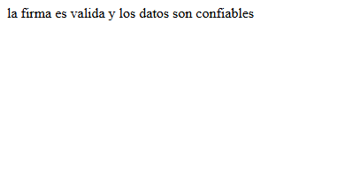
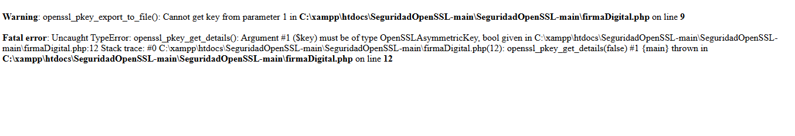

#  Laboratorio: Seguridad en PHP con OpenSSL

##  Descripción

Este laboratorio tiene como objetivo implementar y documentar funciones criptográficas utilizando la biblioteca OpenSSL en PHP.

Se realizaron pruebas de:

- Firma digital
- Verificación de firmas
- Generación de certificados
- Cifrado simétrico AES-128-CBC
- Encriptación básica con OpenSSL

---

# 👨‍💻 Estudiante

- Nombre: Ruben Dominguez 
- Universidad Tecnológica de Panamá
- Facultad de Ingeniería de Sistemas Computacionales
- Desarrollo Web VII – PHP y MySQL
- Docente: Ing. Irina Fong

---

#  Objetivo

Aplicar el uso de OpenSSL en PHP para comprender el funcionamiento de las funciones criptográficas mediante ejemplos prácticos de cifrado, firma digital y verificación.

---

# 🛠 Tecnologías utilizadas

- PHP
- OpenSSL
- XAMPP
- HTML5
- CSS3

---

#  Archivos del proyecto

| Archivo | Descripción |
|---|---|
| encriptacion.php | Sistema web de cifrado AES-128-CBC |
| firma7.php | Firma digital y verificación RSA |
| firmaOtra.php | Generación de certificado X.509 |
| firmaMensaje.php | Firma y verificación de mensajes |
| cifrado_simple.php | Ejemplo de cifrado básico |

---

#  Funciones criptográficas utilizadas

## 1. openssl_encrypt()

### Propósito
Cifrar información utilizando algoritmos criptográficos.

### Parámetros
- Texto a cifrar
- Método de cifrado
- Clave secreta
- Opciones
- IV

### Retorno
Devuelve el texto cifrado.

---

## 2. openssl_decrypt()

### Propósito
Descifrar información previamente cifrada.

### Parámetros
- Texto cifrado
- Método
- Clave
- Opciones
- IV

### Retorno
Texto original descifrado.

---

## 3. openssl_random_pseudo_bytes()

### Propósito
Generar bytes aleatorios criptográficamente seguros para IV.

### Parámetros
- Cantidad de bytes

### Retorno
Bytes aleatorios.

---

## 4. openssl_sign()

### Propósito
Crear una firma digital utilizando una clave privada.

### Parámetros
- Datos
- Variable firma
- Clave privada
- Algoritmo

### Retorno
TRUE o FALSE.

---

## 5. openssl_verify()

### Propósito
Verificar una firma digital usando una clave pública.

### Parámetros
- Datos originales
- Firma
- Clave pública
- Algoritmo

### Retorno
- 1 = Firma válida
- 0 = Firma inválida
- -1 = Error

---

## 6. openssl_pkey_new()

### Propósito
Generar un nuevo par de llaves pública y privada.

### Parámetros
- Configuración RSA

### Retorno
Recurso de clave.

---

## 7. openssl_csr_new()

### Propósito
Crear una solicitud de certificado (CSR).

### Parámetros
- Datos del certificado
- Clave privada
- Configuración

### Retorno
CSR generado.

---

## 8. openssl_csr_sign()

### Propósito
Firmar un certificado digital.

### Parámetros
- CSR
- Certificado CA
- Clave privada
- Días válidos
- Configuración

### Retorno
Certificado firmado.

---

#  Problemas encontrados

## Problema
La ruta del archivo openssl.cnf no funcionaba correctamente en algunos equipos.

## Solución 1
Eliminar la línea de configuración para permitir que XAMPP detecte automáticamente el archivo openssl.cnf.

## Solución 2
Usar rutas dinámicas compatibles con distintas instalaciones de XAMPP.

---

# 📸 Evidencias





#  Explicación del proceso criptográfico

## Firma Digital
La firma digital permite garantizar la autenticidad e integridad de un mensaje utilizando una clave privada y verificando con la clave pública.

## Verificación
Se utiliza la clave pública para comprobar que el mensaje no fue modificado.

## Cifrado Simétrico
AES-128-CBC cifra y descifra información usando la misma clave secreta compartida.

---

#  Conclusión

Este laboratorio permitió comprender el funcionamiento práctico de OpenSSL en PHP, especialmente en procesos de cifrado, generación de certificados y firma digital.

También se aprendió la importancia del uso de IV dinámicos, claves privadas y certificados para proteger la información y validar la autenticidad de los mensajes.

---

#  Cómo ejecutar el proyecto

1. Copiar la carpeta dentro de:
```txt
C:\xampp\htdocs\
